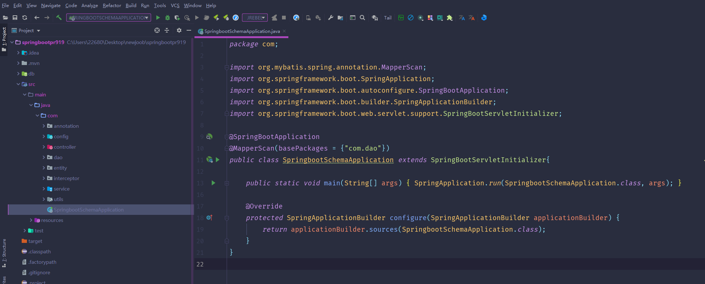
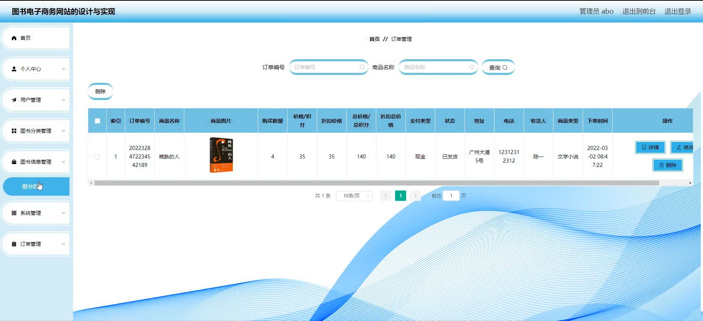
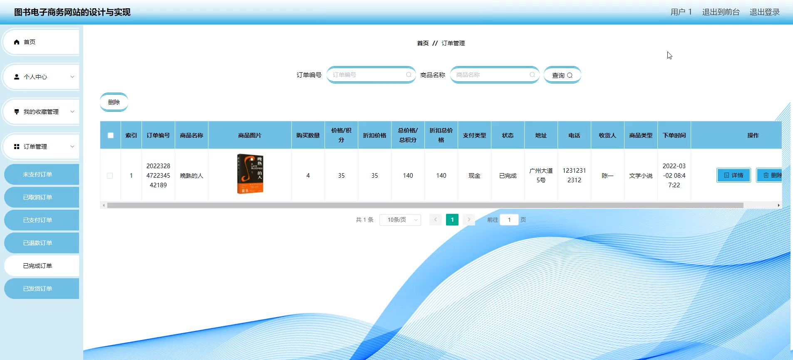

# 基于springboot的图书电子商务网站

#### 介绍

在数字化时代，为了满足读者日益增长的在线购书需求，提供便捷、高效的图书购买体验，我们开发了这个基于 Spring Boot 的图书电子商务网站。该网站旨在整合丰富的图书资源，为用户提供优质的服务，同时为管理员提供高效的管理工具，促进图书销售和文化传播。

#### 技术栈

后端技术栈：Springboot+Mysql+Maven

前端技术栈：Vue+Html+Css+Javascript+ElementUI

开发工具：Idea+Vscode+Navicate

#### 系统功能介绍

（一）管理员角色  
个人中心：管理员在个人中心可以查看和修改自己的个人信息，接收系统通知和重要消息。  
用户管理：对网站注册用户的信息进行管理，包括审核新用户注册申请、查看用户资料、处理用户违规行为等，以维护网站用户的合法性和安全性。  
图书分类管理：对图书进行分类设置和管理，如文学、科技、教育等，方便用户快速找到所需图书，也有助于网站的图书展示和推荐。  
图书信息管理：负责图书的详细信息录入、修改和更新，包括书名、作者、出版社、出版日期、价格、库存数量、图书简介等，确保图书信息的准确性和完整性。  
系统管理：进行网站的系统设置，如页面布局、导航栏设置、支付接口配置、数据备份与恢复等，保障网站的正常运行和维护。  
订单管理：处理用户的订单，包括确认订单、安排发货、跟踪物流、处理退换货等，保证订单流程的顺利进行，提高用户满意度。  

（二）用户角色  
图书信息：用户可以浏览各类图书的详细信息，包括封面图片、内容简介、作者介绍、读者评价等，以便选择感兴趣的图书。  
图书资讯：获取最新的图书出版动态、行业新闻、作者访谈等资讯，了解图书领域的最新趋势。  
个人中心：在个人中心，用户能够查看和修改自己的个人资料、收货地址、查看订单记录、管理收藏的图书等。  
我的收藏管理：用户可以将感兴趣的图书加入收藏夹，方便后续查看和购买，同时对收藏的图书进行管理，如删除不再感兴趣的图书。  
订单管理：查看自己的订单状态，包括已下单、已发货、已签收等，以及对订单进行评价和申诉。  
购物车：将心仪的图书加入购物车，在购物车中可以调整购买数量、删除商品、结算支付等。  
在线客服：在购书过程中遇到问题时，随时与在线客服沟通，获取帮助和解答疑问。  

#### 系统作用

该图书电子商务网站的主要作用是为用户提供一个便捷、安全的在线购书平台，丰富用户的购买体验。同时，通过管理员的有效管理，确保图书信息的准确性和订单处理的高效性。系统的主要作用包括：  

提供多种图书分类和详细的图书信息，帮助用户快速找到所需图书。  
支持用户收藏、购物车、订单管理等功能，提升用户购物体验。  
提供实时的图书资讯和在线客服服务，满足用户的多样需求。  
管理员可以高效管理图书信息、用户信息和订单，保证系统的顺畅运行和维护。  

#### 系统功能截图

代码结构

数据库表

登录

前台界面首页

图书信息

个人中心

购物车

在线客服

图书信息管理

图书资讯

用户端订单管理

图书信息评价管理

#### 总结

基于 Spring Boot 的图书电子商务网站，通过清晰划分管理员和用户的功能模块，实现了图书销售的线上化和管理的智能化。这不仅满足了用户便捷购书的需求，也为图书销售商提供了高效的运营平台，有助于推动图书行业的发展和文化的传播。

#### 使用说明

创建数据库，执行数据库脚本 修改jdbc数据库连接参数 下载安装maven依赖jar 启动idea中的springboot项目

后台地址：http://localhost:8080/springbootpr919/admin/dist/index.html

管理员  abo 密码 abo

前台地址：http://localhost:8080/springbootpr919/front/index.html
